# 🗺️ Master Flowchart Lengkap Sistem Lapor JakBan

Dokumen ini adalah **panduan flowchart paling komprehensif** yang memetakan seluruh perjalanan sistem sejak **pertama kali URL web dibuka di browser**, proses pemilihan login/daftar/lupa password, verifikasi keamanan OTP, hingga percabangan akses sesuai hak akses (**Admin** vs **Pelapor/User**).

---

## 1. Master Flowchart: Dari Pertama Kali Buka Web (End-to-End)

```mermaid
graph TD
    %% Styling Classes
    classDef startEnd fill:#0F172A,stroke:#38BDF8,stroke-width:2px,color:#FFFFFF;
    classDef decision fill:#1E293B,stroke:#F59E0B,stroke-width:2px,color:#FFFFFF;
    classDef publicFlow fill:#EFF6FF,stroke:#2563EB,stroke-width:2px,color:#0F172A;
    classDef userFlow fill:#ECFDF5,stroke:#059669,stroke-width:2px,color:#064E3B;
    classDef adminFlow fill:#FEF3C7,stroke:#D97706,stroke-width:2px,color:#78350F;
    classDef systemCloud fill:#F8FAFC,stroke:#64748B,stroke-width:2px,stroke-dasharray: 5 5,color:#0F172A;

    Start([Pengguna Buka URL Web Lapor JakBan]):::startEnd --> CheckSession{Ada Sesi Login Aktif?<br/>Cek Token JWT di Browser}:::decision

    %% --- CABANG BELUM LOGIN ---
    CheckSession -- Tidak Ada Token --> LoginPage[Masuk ke Halaman Login / Auth]:::publicFlow

    LoginPage --> AuthChoice{Pilih Menu / Tindakan di Halaman Login?}:::decision

    %% OPSI 1: LOGIN BIASA
    AuthChoice -- 1. Masuk / Login Biasa --> InputCreds[Masukkan Username/Email & Password]:::publicFlow
    InputCreds --> VerifyCreds{Kredensial Cocok di Database?}:::decision
    VerifyCreds -- Salah --> LoginError[Muncul Peringatan: Email / Password Salah]:::publicFlow
    LoginError --> InputCreds
    VerifyCreds -- Benar --> IssueJWT[Terbitkan Token JWT & Simpan ke Session]:::systemCloud

    %% OPSI 2: LOGIN GOOGLE
    AuthChoice -- 2. Masuk via Google --> GoogleAuth[Klik Tombol 'Masuk dengan Google']:::publicFlow
    GoogleAuth --> GooglePopup[Popup Google Auth Firebase]:::systemCloud
    GooglePopup --> GoogleVerify{Otentikasi Google Berhasil?}:::decision
    GoogleVerify -- Batal / Gagal --> LoginPage
    GoogleVerify -- Berhasil --> SyncGoogleUser[Sinkronisasi / Daftarkan Akun Otomatis]:::systemCloud
    SyncGoogleUser --> IssueJWT

    %% OPSI 3: DAFTAR AKUN BARU (REGISTER)
    AuthChoice -- 3. Daftar Akun Baru --> RegForm[Isi Form: Nama Lengkap, Email, Divisi, Password]:::publicFlow
    RegForm --> CheckExist{Email Sudah Terdaftar?}:::decision
    CheckExist -- Ya --> RegEmailError[Muncul Pesan: Email Sudah Terdaftar]:::publicFlow
    RegEmailError --> RegForm
    CheckExist -- Belum --> GenOTPReg[Backend Buat Kode OTP 6-Digit<br/>Masa Aktif: 5 Menit]:::systemCloud
    GenOTPReg --> SendBrevoReg[Brevo Kirim Email OTP Resmi ke Inbox User]:::systemCloud
    SendBrevoReg --> OTPRegPage[Pindah ke Halaman Input OTP Registrasi]:::publicFlow
    OTPRegPage --> InputOTPReg[Ketik 6 Kotak Digit OTP]:::publicFlow
    InputOTPReg --> ValidateOTPReg{Kode OTP Cocok & Belum Expired?}:::decision
    ValidateOTPReg -- Salah / Expired --> OTPRegFail[Peringatan Salah / Opsi Kirim Ulang OTP]:::publicFlow
    OTPRegFail --> InputOTPReg
    ValidateOTPReg -- Valid --> HashPass[Enkripsi Password dengan Bcrypt]:::systemCloud
    HashPass --> CreateUserDB[Simpan Akun Baru ke Firestore 'users']:::systemCloud
    CreateUserDB --> DeleteTempOTP[Hapus Data OTP Sementara dari Database]:::systemCloud
    DeleteTempOTP --> IssueJWT

    %% OPSI 4: LUPA PASSWORD
    AuthChoice -- 4. Lupa Password? --> ForgotPage[Input Alamat Email Terdaftar]:::publicFlow
    ForgotPage --> CheckForgotEmail{Email Ada di Sistem?}:::decision
    CheckForgotEmail -- Tidak Ada --> ForgotEmailErr[Pesan: Email Tidak Ditemukan]:::publicFlow
    ForgotEmailErr --> ForgotPage
    CheckForgotEmail -- Ada --> GenOTPReset[Generate Kode OTP Reset Password]:::systemCloud
    GenOTPReset --> SendBrevoReset[Brevo Kirim Email Reset Password]:::systemCloud
    SendBrevoReset --> ResetPage[Input 6 Digit OTP + Password Baru & Konfirmasi]:::publicFlow
    ResetPage --> ValidateOTPReset{OTP Benar & Belum Expired?}:::decision
    ValidateOTPReset -- Salah --> ResetFail[Pesan: Kode OTP Salah]:::publicFlow
    ResetFail --> ResetPage
    ValidateOTPReset -- Benar --> UpdateNewPass[Update Password Baru di Database]:::systemCloud
    UpdateNewPass --> ResetSuccess[Sukses! Kembali ke Halaman Login]:::publicFlow
    ResetSuccess --> LoginPage

    %% --- CABANG SETELAH PUNYA SESI (LOGIN BERHASIL) ---
    CheckSession -- Ada Token JWT Sah --> RoleCheck{Cek Role Pengguna di Token}:::decision
    IssueJWT --> RoleCheck

    %% ==========================================
    %% JALUR 1: ADMIN (TIM MAINTENANCE & FASILITAS)
    %% ==========================================
    RoleCheck -- Role = 'admin' --> AdminEntry[Diarahkan ke /dashboard Admin]:::adminFlow

    AdminEntry --> AdminMenu{Pilih Menu Navigasi Admin?}:::decision

    %% Menu 1: Dashboard Admin
    AdminMenu -- Dashboard Monitoring --> AdminDash[Lihat KPI Card: Total, Menunggu, Diproses, Selesai<br/>Grafik Bar Kategori Kerusakan & Pie Status]:::adminFlow

    %% Menu 2: Kelola Laporan
    AdminMenu -- Kelola Laporan (/admin/laporan) --> AdminReports[Buka Panel Manajemen Semua Tiket Masuk]:::adminFlow
    AdminReports --> FilterAction{Gunakan Filter / Pencarian?}:::decision
    FilterAction -- Ya --> ApplyFilters[Filter: Status, Kategori, Prioritas, Tanggal, Cari Nama]:::adminFlow
    FilterAction -- Tidak --> ViewAllReports[Tampilkan Seluruh Laporan Realtime]:::adminFlow
    ApplyFilters --> ViewAllReports

    ViewAllReports --> TicketAction{Pilih Aksi Tiket?}:::decision
    TicketAction -- Klik Detail --> OpenModalDetail[Buka Modal: Foto Bukti Kerusakan, Log Audit, Catatan]:::adminFlow
    OpenModalDetail --> UpdateStatusAdmin[Ubah Status: Diproses / Selesai / Ditolak]:::adminFlow
    UpdateStatusAdmin --> SaveStatusLog[Simpan Perubahan & Catat Log Aktivitas Realtime]:::systemCloud
    
    TicketAction -- Komunikasi --> OpenAdminChat[Buka Live Chat Tiket dengan Pelapor]:::adminFlow
    OpenAdminChat --> SendAdminMsg[Kirim Pesan Bantuan via Firestore Realtime]:::systemCloud

    TicketAction -- Ekspor Rekap --> ExportChoice{Pilih Format Ekspor?}:::decision
    ExportChoice -- PDF --> DownloadPDF[Generate Dokumen Rekap Resmi Berlogo via jsPDF]:::adminFlow
    ExportChoice -- Excel --> DownloadExcel[Generate File Spreadsheet .xlsx via ExcelJS]:::adminFlow

    %% Menu 3: Profil Admin
    AdminMenu -- Profil Saya --> AdminProfile[Edit Nama, Ganti Password, Ganti Foto Avatar]:::adminFlow
    AdminProfile --> UploadAdminAvatar[Unggah Avatar ke Vercel Blob]:::systemCloud

    %% Menu 4: Logout Admin
    AdminMenu -- Keluar / Logout --> LogoutAdmin[Hapus Sesi sessionStorage]:::publicFlow
    LogoutAdmin --> LoginPage

    %% ==========================================
    %% JALUR 2: USER / KARYAWAN (PELAPOR)
    %% ==========================================
    RoleCheck -- Role = 'user' --> UserEntry[Diarahkan ke /riwayat Laporan Saya]:::userFlow

    UserEntry --> UserMenu{Pilih Menu Navigasi Pelapor?}:::decision

    %% Menu 1: Form Buat Laporan Baru
    UserMenu -- Buat Laporan (/lapor) --> FormLapor[Buka Form Pengaduan Fasilitas]:::userFlow
    FormLapor --> FillForm[Isi: Nama, Divisi, Lokasi/Ruangan, Kategori, Nama Barang, Deskripsi, Prioritas]:::userFlow
    FillForm --> AttachPhoto{Lampirkan Foto Kerusakan?}:::decision
    AttachPhoto -- Ya --> SelectPhoto[Pilih Foto Galeri / Kamera HP Max 5MB]:::userFlow
    SelectPhoto --> UploadVercelBlob[Unggah Gambar ke Vercel Blob Storage]:::systemCloud
    AttachPhoto -- Tidak --> SubmitReport[Klik Tombol 'Kirim Laporan']:::userFlow
    UploadVercelBlob --> SubmitReport

    SubmitReport --> GenTicketNumber[Sistem Generate No Tiket Unik: TKT-XXXXXX]:::systemCloud
    GenTicketNumber --> SaveReportDB[Simpan Tiket ke Firestore 'reports']:::systemCloud
    SaveReportDB --> ShowInvoiceModal[Muncul Modal Tanda Terima / Bukti Tiket Sah]:::userFlow
    ShowInvoiceModal --> PrintOrSavePDF[Opsi: Cetak Tanda Terima / Unduh Bukti PDF]:::userFlow
    PrintOrSavePDF --> RedirectRiwayat[Pindah ke Halaman Riwayat Saya]:::userFlow

    %% Menu 2: Riwayat Laporan Saya
    UserMenu -- Riwayat Laporan (/riwayat) --> ViewMyReports[Tampilkan Kartu & Tabel Tiket Milik Sendiri]:::userFlow
    RedirectRiwayat --> ViewMyReports
    ViewMyReports --> MyTicketAction{Pilih Aksi pada Laporan?}:::decision
    MyTicketAction -- Cek Detail & Progres --> ViewTicketProgress[Lihat Status: Menunggu / Diproses / Selesai<br/>Lihat Catatan Teknisi & Estimasi Waktu]:::userFlow
    MyTicketAction -- Chat Teknisi --> ChatWithTech[Kirim & Balas Pesan Chat Terkait Tiket Ini]:::userFlow

    %% Menu 3: Profil Pelapor
    UserMenu -- Profil Saya --> UserProfile[Edit Nama, Divisi, Ganti Password, Ganti Avatar]:::userFlow

    %% Menu 4: Logout Pelapor
    UserMenu -- Keluar / Logout --> LogoutUser[Hapus Sesi sessionStorage]:::publicFlow
    LogoutUser --> LoginPage
```

---

## 2. Rincian Penjelasan Setiap Tahap (*Step-by-Step Breakdown*)

### 🔹 Fase 1: Pengecekan Sesi Awal (*Initialization*)
1. Pengguna membuka URL aplikasi.
2. Sistem mengecek memori browser (`sessionStorage.getItem('app_token')`).
   - **Jika ada token valid:** Langsung diarahkan sesuai rolenya (**Admin** ➔ `/dashboard`, **User** ➔ `/riwayat`).
   - **Jika tidak ada token:** Diarahkan ke halaman `/login`.

---

### 🔹 Fase 2: Pilihan di Halaman Login (`/login`)
Pada halaman depan, pengguna memiliki 4 pilihan interaksi:
1. **Masuk (Login Akun Biasa):** Menggunakan kombinasi Email & Password yang sudah pernah dibuat.
2. **Masuk dengan Akun Google:** Login 1-klik menggunakan popup Google OAuth resmi.
3. **Daftar Akun Baru (Register):**
   - Pengguna mengisi data diri (Nama, Email kantor, Divisi, Password).
   - Server membuat kode OTP 6-digit (kedaluwarsa 5 menit).
   - Layanan **Brevo API** mengirimkan email resmi berlogo **Lapor JakBan**.
   - Pengguna mengetik 6-digit OTP pada kotak verifikasi.
   - Jika valid, password di-hash dengan **Bcrypt**, akun disimpan ke **Firestore**, dan otomatis login.
4. **Lupa Password:**
   - Memasukkan email terdaftar.
   - Sistem mengirimkan kode OTP Reset Password ke email.
   - Pengguna memasukkan OTP + Password baru.
   - Password diperbarui di database dan pengguna dapat login kembali.

---

### 🔹 Fase 3: Alur Kerja Pelapor / Karyawan (*User Flow*)
Setelah berhasil login sebagai **User (Pelapor)**:
* **Halaman `/lapor` (Buat Aduan):**
  - Mengisi form kerusakan fasilitas (Elektronik, Infrastruktur, Furniture, Jaringan, Lainnya).
  - Mengunggah foto kerusakan (disimpan aman di **Vercel Blob Storage**).
  - Menentukan prioritas (*Rendah, Sedang, Tinggi*).
  - Menerima nomor tiket resmi berformat `TKT-XXXXXX` dan dapat mencetak tanda terima invoice.
* **Halaman `/riwayat` (Pemantauan):**
  - Melihat status terkini aduan (*Menunggu ➔ Diproses ➔ Selesai / Ditolak*).
  - Membuka live chat per-tiket untuk berkomunikasi langsung dengan teknisi yang menangani.
* **Halaman `/profil`:**
  - Memperbarui foto profil avatar dan mengubah password.

---

### 🔹 Fase 4: Alur Kerja Admin & Teknisi (*Admin Flow*)
Setelah berhasil login sebagai **Admin**:
* **Halaman `/dashboard` (Statistik & Analisis):**
  - Memantau ringkasan total aduan yang menunggu, sedang dikerjakan, dan selesai.
  - Membaca grafik kategori fasilitas yang paling sering rusak.
* **Halaman `/admin/laporan` (Pusat Kendali Tiket):**
  - Menyaring aduan berdasarkan tanggal, divisi, kategori, dan prioritas.
  - Membuka detail tiket, mengubah status perbaikan, dan memberikan catatan teknis.
  - Berkomunikasi dua arah via live chat realtime dengan pelapor.
  - **Fitur Ekspor:** Mencetak rekapitulasi data laporan ke format **PDF Resmi** atau **Microsoft Excel (.xlsx)** untuk bahan rapat evaluasi pimpinan.
* **Halaman `/profil`:** Mengelola akun administratif.

---

### 🔹 Fase 5: Logout & Pengamanan Sesi
* Pengguna dapat mengklik tombol **"Keluar / Logout"** di menu profil.
* Browser langsung membersihkan tiket token JWT dari `sessionStorage`.
* Pengguna kembali ke layar Login dan data aman dari akses orang lain di komputer kantor.
