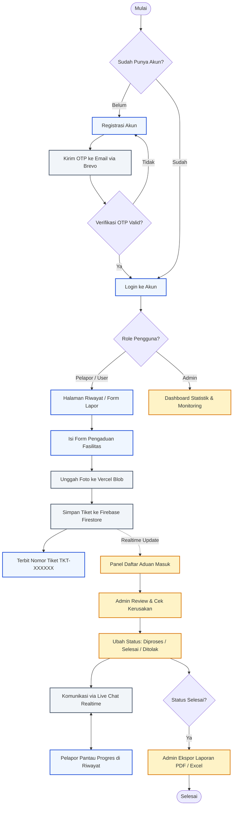
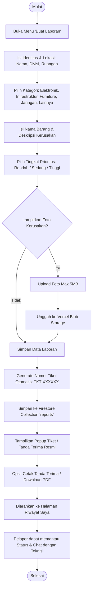
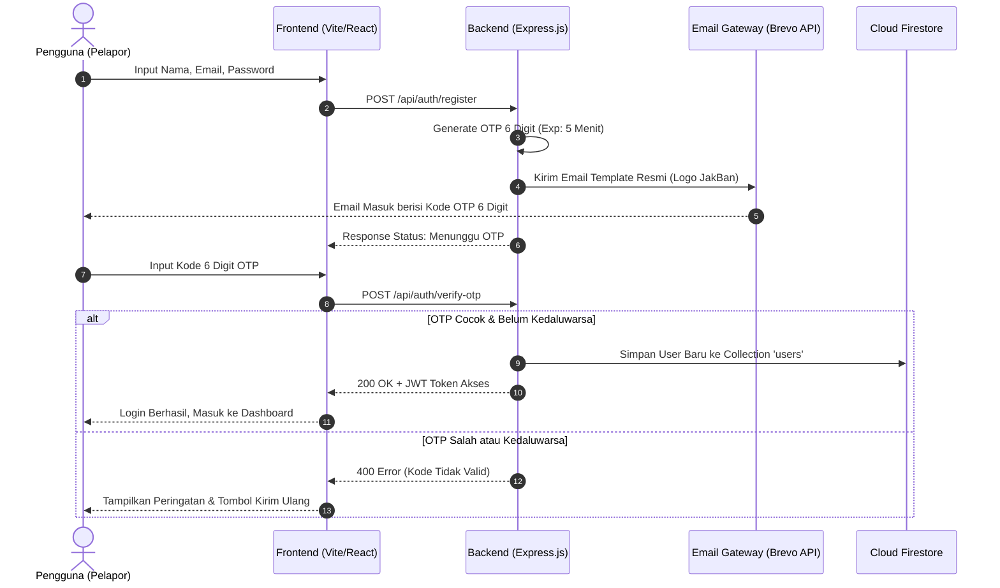

# 🗺️ Flowchart Sistem Lapor JakBan

Dokumen ini memetakan seluruh alur kerja (*business workflow*) dan proses teknis pada aplikasi **Lapor JakBan**, mulai dari registrasi akun, pembuatan tiket aduan, proses penanganan oleh admin/teknisi, hingga integrasi cloud realtime.

---

## 1. Alur Utama Sistem (Overview End-to-End)

Diagram berikut menggambarkan interaksi antara **Pelapor**, **Sistem Backend / Cloud**, dan **Admin**:



---

## 2. Alur Pelapor: Pembuatan Pengaduan & Tracking

Alur detail saat seorang karyawan/pelapor melaporkan kerusakan fasilitas:



---

## 3. Alur Admin: Penanganan Laporan & Manajemen Data

Alur kerja petugas/admin dalam merespon dan memproses tiket aduan yang masuk:

```mermaid
flowchart TD
    A([Admin Login]) --> B[Buka Panel 'Admin Laporan']
    B --> C{Gunakan Filter?}
    
    C -- Ya --> D[Filter: Status, Kategori, Prioritas, Rentang Tanggal, atau Cari Nama]
    C -- Tidak --> E[Tampilkan Semua Tiket Terurut Terbaru]
    D --> E

    E --> F[Klik Detail Tiket]
    F --> G[Buka Modal Detail: Foto Kerusakan, Log Aktivitas, Riwayat Status]
    
    G --> H{Aksi yang Dipilih?}
    
    H -- Ubah Status --> I[Ubah Status: 'Menunggu' -> 'Diproses' -> 'Selesai' / 'Ditolak']
    H -- Ubah Prioritas --> J[Sesuaikan Prioritas Urgensi]
    H -- Koordinasi --> K[Kirim Pesan Live Chat ke Pelapor]
    H -- Hapus --> L[Konfirmasi Hapus Tiket Permanen]

    I --> M[Catat Log Aktivitas Otomatis di Database]
    J --> M
    K --> M
    L --> M

    M --> N{Butuh Rekap Data?}
    N -- Ya --> O[Pilih 'Ekspor PDF Resmi' atau 'Ekspor Excel (XLSX)']
    O --> P[File Rekapitulasi Terunduh Otomatis]
    N -- Tidak --> Q([Selesai])
    P --> Q
```

---

## 4. Alur Otentikasi & Verifikasi OTP Email

Alur keamanan akun menggunakan OTP 6-Digit via Brevo REST API:



---

## 5. Ringkasan Status & Siklus Hidup Tiket (*Ticket Lifecycle*)

| Status | Badge Warna | Makna & Tindakan |
|---|---|---|
| **Menunggu** | 🟡 Kuning | Laporan baru masuk dari pelapor, menunggu respon/tinjauan admin. |
| **Diproses** | 🔵 Biru | Laporan sudah diterima teknisi dan dalam proses perbaikan di lapangan. |
| **Selesai** | 🟢 Hijau | Kerusakan fasilitas telah berhasil diperbaiki secara tuntas. |
| **Ditolak** | 🔴 Merah | Laporan tidak valid, duplikat, atau di luar tanggung jawab fasilitas kantor. |
